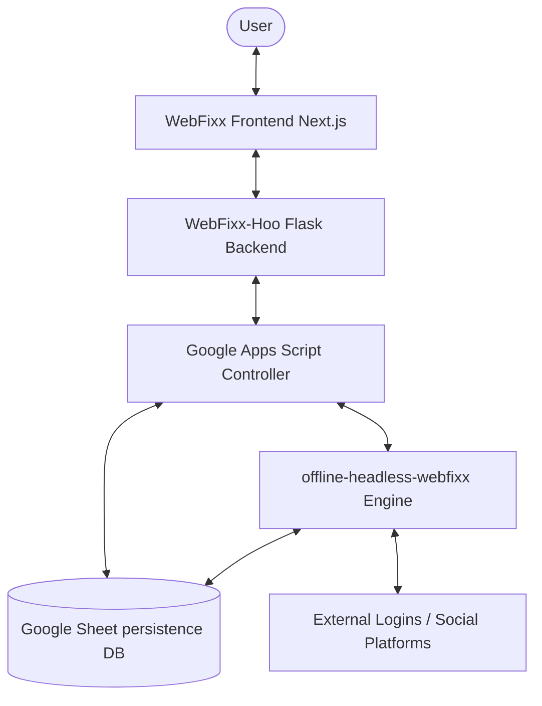

# Serverless Headless Engine Architecture: `offline-headless-webfixx`

This document details the architecture, design patterns, core subsystems, and ecosystem integrations of the **`offline-headless-webfixx`** headless browser automation engine.

---

## 1. Landscape & Ecosystem Role

`offline-headless-webfixx` is a highly optimized, serverless-ready Puppeteer engine designed to handle robust, multi-browser automated workflows. Inside the wider **WebFixx Ecosystem**, it serves as the autonomous browser worker that translates logical instructions from the **Logic Layer (Google Apps Script / Sheets)** and **WebFixx-Hoo Gateway** into high-fidelity web interactions.



### Core Responsibilities
*   **Headless Session Orchestration**: Logging into complex web services, solving verification challenges, and extracting active sessions (cookies/local storage).
*   **Real-time persistence updating**: Modifying spreadsheet-backed data queues directly via secure OAuth2 Google Sheet integrations (`googlesheets.js`) or falling back to custom Google Apps Script webhooks.
*   **Intelligent Interaction Loop**: Using generative models (Gemini/OpenAI) to guide 2FA decisions, read verification elements, and handle unexpected verification prompts.

---

## 2. Technology Stack

*   **Runtime & Framework**: Next.js v14.0.4 (App Router, Node.js)
*   **Browser Orchestration**: `puppeteer-core` (v22.15.0) paired with `@sparticuz/chromium-min` (v122.0.0) optimized for serverless runtime constraints (Vercel serverless limits).
*   **Persistence & Drive**: `googleapis` (v148.0.0) for Sheets & Drive operations, and `archiver` for session profile packing.
*   **Generative AI Subsystem**: `@google/generative-ai` and `openai` SDKs for dynamic decision-making.
*   **Styling & Interface (Status UI)**: Tailwind CSS & Framer Motion.

---

## 3. Subsystem Breakdown

### A. The Headless Automation Controller
Located under `src/app/emails/cookie` and `src/app/socials`, the controllers govern automated session generation.
*   **Platform Configuration (`platforms.js`)**: Encapsulates login URLs, CSS selectors for credentials, 2FA inputs, page verification checkpoints, and timing guidelines.
*   **Execution Route (`route.js` & `routeHelper.js`)**: Implements concurrency-managed task queues:
    *   **Browser Spawning**: Launches isolated browser contexts via dynamic launch configs.
    *   **Interactive Flow**: Performs keystrokes, button triggers, and handles verification screens (e.g. recovery phone updates, password confirmations, and 2FA prompt options).
    *   **Profile Archiving**: Packages session profiles and uploads them to Google Drive (`googledrive.mjs`) once a login successfully finishes.

### B. Google Sheets & Drive Database Gateway
The `src/app/api/googlesheets.js` and `src/app/api/googledrive.mjs` files implement standard data transactions:
*   **Dynamic Read/Write**: Queries operational sheets to check active tasks (`getSheetDataApi`) and updates rows with session profiles, active cookies, IP configurations, and execution statuses.
*   **GAS Fallbacks**: Incorporates automatic HTTP/GAS triggers to ensure status propagation even if direct Google API quotas are restricted.

### C. Generative AI Logic Core
Defined in `src/utils/geminiHelper.js`, `src/utils/ollamaHelper.js`, and `src/utils/multiProviderAI.js`:
*   Allows the automation loop to parse verification screens, choose alternative authentication vectors (e.g., choosing 2FA options dynamically), and solve layout challenges through vision APIs.

---

## 4. Key Code Abstractions & "God Nodes"

According to our semantic knowledge graph, these are the core abstractions organizing the project's logic:

1.  **`updateHubAndProjectsFromCookieData()`** *(Google Sheets)*: Syncs newly extracted session cookie configurations directly back into central sheets, triggering telegram notifications and project state updates.
2.  **`MultiProviderAI`** *(Utils)*: The multi-provider AI coordinator, routing LLM reasoning tasks smoothly between Gemini, OpenAI, or Ollama.
3.  **`getSheetDataApi()` / `updateSheetRowApi()`** *(Google Sheets API)*: Lower-level OAuth2 transactional bridges communicating with the Google Sheets DB.
4.  **`getPlatformConfig()`** *(Automation Route)*: Selects platform-specific selectors, rules, and timeouts based on targeted email/social domains.
5.  **`processRow()` / `processTask()`** *(Automation Route)*: Orchestrates the multi-stage queue lifecycle, handling setup, profile retrieval, login flow, 2FA wait intervals, and cleanup sweeps.

---

## 5. Concurrency & Queue Lifecycle

To operate within serverless limits, the engine uses a robust, lightweight concurrency limit queue:
*   **`MAX_CONCURRENT_BROWSERS`**: Defaulted to `3` concurrent active page execution contexts to manage memory footprint and prevent target throttling.
*   **Process Set Tracking**: Active execution contexts are kept in a shared memory `Set` that safely shuts down idle headless pages when execution finishes or a timeout threshold is exceeded.

---

## 6. Graphify Integration (Knowledge Graph Superpowers)

`offline-headless-webfixx` has the same structural knowledge graphing capability initialized in its sibling codebases. This allows AI assistants and developer runtimes to navigate the modules semantically rather than relying on textual grep searches.

### Current Graph Statistics
*   **Nodes**: 326
*   **Edges**: 557
*   **Communities**: 29

### Graph Navigation Commands
To compile, analyze, or verify the codebase graph, use these python tools in the root directory:
*   **Check Detected Corpus**:
    ```bash
    python read_detect.py
    ```
*   **Re-Extract AST Nodes**:
    ```bash
    python run_ast.py
    ```
*   **Full Build & Semantic Re-Extraction**:
    ```bash
    python -m graphify update .
    ```

The visual graph representation is located in [graphify-out/graph.html](file:///c:/Users/HP/Desktop/ZIPPER/WEBFIXX/DEV/API/offline-headless-webfixx/graphify-out/graph.html) and the structural report is in [graphify-out/GRAPH_REPORT.md](file:///c:/Users/HP/Desktop/ZIPPER/WEBFIXX/DEV/API/offline-headless-webfixx/graphify-out/GRAPH_REPORT.md).
